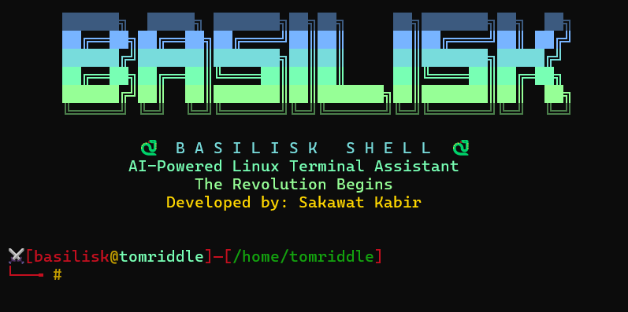

# 🐍 BasiliskShell

**AI-Powered Linux Terminal Assistant** — a custom shell with built-in AI that translates natural language into safe, audited Bash commands.

> Powered by **Groq Cloud** running **Llama 3.3 70B**

<p align="center">
  
</p>

```
⚔ [basilisk@user]─[/home/user]
└──╼ # aibasilisk

  > show me all processes using more than 500MB of RAM

  Command      ps aux --sort=-%mem | awk 'NR==1 || $6>512000'
  Explanation  Lists all running processes sorted by memory usage,
               showing only those consuming more than 500 MB of RAM.
  Risk          LOW

  Execute? [y/N]
```

---

## Features

| Feature | Description |
|---------|-------------|
| 🐍 **Custom Bash Shell** | Full interactive shell with login system, command history, and custom prompt |
| 🤖 **AI Command Generation** | Describe tasks in plain English (or Bangla, Hindi, Arabic, Spanish…) — get accurate Bash commands |
| 🛡️ **3-Layer Security** | AI validation → static blocklist audit → sandboxed execution |
| 📖 **AI Explanations** | Type `explain <command>` to get beginner-friendly breakdowns of any Linux concept |
| 📊 **System Monitor** | Built-in `system` and `system live` commands for real-time resource monitoring |
| 🔐 **User Authentication** | Password-protected login with SHA-256 hashing |
| 📝 **Command Logging** | All AI-generated commands are logged with timestamps, risk levels, and execution status |
| 🌍 **Multilingual Input** | AI understands requests in multiple languages and always responds in English |

---

## Quick Start

### 1. Clone the repository

```bash
git clone https://github.com/sakawatkabir13/basilisk-shell
cd basilisk-shell
```

### 2. Run the setup script

```bash
python3 initial_setup.py
```

This will:
- Update system packages
- Create a Python virtual environment
- Install required Python packages (`groq`, `python-dotenv`)
- Generate `run.sh` (venv activator + launcher)
- Set executable permissions on scripts
- Create a global `/usr/local/bin/basilisk` symlink

### 3. Launch BasiliskShell

```bash
basilisk
```

On first launch, you'll be prompted to:
1. Create a username and password
2. Enter your **Groq API key** (saved to `.env` automatically)

> Get a free API key at [console.groq.com](https://console.groq.com)

---

## Usage

### Shell Commands

Once inside BasiliskShell, you get a full interactive shell:

```
⚔ [basilisk@user]─[~/projects]
└──╼ # ls -la            ← Regular commands work normally
└──╼ # cd /var/log        ← Directory navigation
└──╼ # cat file.txt | grep error  ← Pipes supported
└──╼ # long_task &        ← Background jobs supported
```

### Built-in Commands

| Command | Description |
|---------|-------------|
| `help` | Show the command center menu |
| `system` | Display CPU, memory, disk usage, and top process |
| `system live` | Live-updating system monitor (refreshes every 2s) |
| `aibasilisk` | Launch the AI assistant (also: `ai`, `aishell`, `basiliskai`) |
| `history` | Show command history |
| `clear` | Clear the screen |
| `exit` | Exit BasiliskShell |

### AI Assistant

Once inside the AI assistant (`aibasilisk`), describe what you want:

```
  > find all log files larger than 100MB
  > restart the nginx service
  > compress the /var/log directory into a tar.gz
  > show disk space on all mount points
```

#### Explain Mode

Ask the AI to explain any command or concept:

```
  > explain awk
  > what is chmod
  > tell me about grep
  > describe systemctl
```

#### Multilingual Support

The AI understands requests in many languages:

```
  > বিস্তারিত সহ সমস্ত ফাইল দেখান        (Bangla)
  > mostrar todos los archivos ocultos   (Spanish)
  > عرض استخدام القرص                     (Arabic)
```

#### AI Assistant Controls

| Input | Action |
|-------|--------|
| `exit` / `quit` / `q` | Exit the AI assistant |
| `/history` | View AI command log |
| `#comment` | Ignored (comment line) |

---

## Project Structure

```
basiliskshell/
├── assets/
│   └── basilisk_banner.png   # Terminal screenshot for README
├── initial_setup.py           # Automated setup script (venv, packages, symlink)
├── basilisk.sh                # Main shell — login, prompt, built-in commands
├── basilisk_ai_setup.py       # AI assistant — command generation, explanations
├── run.sh                     # Auto-generated venv activator + launcher
├── .env                       # Auto-generated API key storage (gitignored)
├── basilisk_cmd_history.log   # AI command execution log
└── README.md                  # This file
```

---

## Configuration (`.env`)

Created automatically on first run. You can also edit manually:

```env
GROQ_API_KEY=paste_your_api_key_here
```

| Variable | Description |
|----------|-------------|
| `GROQ_API_KEY` | Your Groq Cloud API key ([get one here](https://console.groq.com)) |

The AI uses **Llama 3.3 70B Versatile** via Groq at `temperature=0.2` for consistent, accurate results.

---

## 🛡️ Security Architecture

BasiliskShell implements a **defence-in-depth** security model across three layers.

### Layer 1 — AI Output Validation

The AI must return **only valid JSON** matching this schema:

```json
{
  "command": "<bash command>",
  "explanation": "<what it does>",
  "risk_level": "low | medium | high"
}
```

Any response that is not valid JSON, is missing required fields, or contains an invalid risk level is **rejected entirely**.

### Layer 2 — Static Security Audit

Every generated command passes through `security_audit()` before display or execution.

**Hard Block List** — commands containing these patterns are unconditionally refused:

| Pattern | Reason |
|---------|--------|
| `rm -rf /` | Deletes entire filesystem |
| `mkfs` | Formats/destroys a disk partition |
| `dd if=` | Raw disk write — can destroy data |
| `:(){:\|:&};:` | Fork bomb — crashes the system |
| `chmod 777 /` / `chmod -R 777 /` | Removes all filesystem protections |
| `> /dev/sda` | Overwrites raw disk |
| `curl \| bash` / `wget \| bash` | Remote code execution |
| `curl \| sh` / `wget \| sh` | Remote code execution |

**Escalation Patterns** — presence of these **upgrades the risk level to HIGH**:

| Pattern | Reason |
|---------|--------|
| `sudo` | Requests elevated privileges |
| `*` or `?` | Wildcards can match unintended files |
| `;`, `&&`, `\|\|` | Command chaining can execute unintended commands |
| `\|` | Piping data between commands |

### Layer 3 — Execution Hardening

```python
subprocess.run(
    shlex.split(command),   # Safe tokenisation — no shell interpretation
    shell=False,            # NEVER shell=True — prevents injection
    capture_output=True,
    timeout=30,             # Hard timeout — prevents runaway commands
)
```

### Confirmation Gates

| Risk Level | Confirmation Required |
|------------|----------------------|
| `low` | `y` / `yes` |
| `medium` | `y` / `yes` |
| `high` | Must type exactly `YES` |
| Blocked | Execution refused — no confirmation offered |

---

## Logging

All AI-generated commands are logged to `basilisk_cmd_history.log`:

```
[2026-02-23 14:23:01] Request: 'show open ports', Running: 'ss -tulnp', Risk: low, Status: EXIT_0
[2026-02-23 14:24:15] Request: 'delete all logs', Running: 'rm -rf /var/log/*', Risk: high, Status: BLOCKED
[2026-02-23 14:25:30] Request: 'list files', Running: 'ls -lah', Risk: low, Status: CANCELLED
```

View the log anytime with `/history` inside the AI assistant.

---

## Dependencies

| Package | Purpose |
|---------|---------|
| `groq` | Groq Cloud API client (Llama 3.3 70B) |
| `python-dotenv` | `.env` file loading |

**System requirements:**
- Python ≥ 3.10
- Bash
- Debian-based Linux (for `apt` in setup)
- `sudo` access (for setup symlink)

---

## 👤 Author

**Sakawat Kabir Tanveer**

[](https://www.linkedin.com/in/s-kbr13)
[](https://x.com/tanveer_sakawat)

---

## 📜 License

This project is licensed under the **MIT License**.

---


