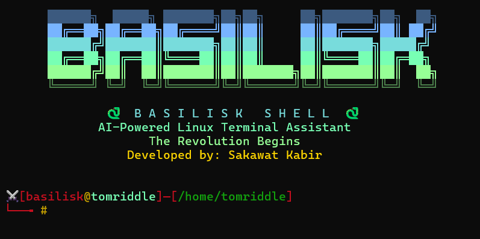

<div align="center">

# 🐍 BasiliskShell

**AI-Powered Linux Terminal Assistant** — a custom interactive shell with a built-in AI that translates natural language into safe, audited Bash commands.

> Powered by **Groq Cloud** running **Llama 3.3 70B**

<p align="center">
  
</p>

<p align="center">
  <a href="https://github.com/sakawatkabir13/basilisk-shell/blob/main/LICENSE">
    
  </a>
  <a href="https://github.com/sakawatkabir13/basilisk-shell/stargazers">
    
  </a>
  <a href="https://github.com/sakawatkabir13/basilisk-shell/network/members">
    
  </a>
  <a href="https://github.com/sakawatkabir13/basilisk-shell/issues">
    
  </a>
  <a href="https://github.com/sakawatkabir13/basilisk-shell/commits/main">
    
  </a>
  <a href="https://www.python.org/">
    
  </a>
  <a href="https://groq.com/">
    
  </a>
</p>

</div>

---

## 📑 Table of Contents

- [✨ Features](#-features)
- [🎬 Demo](#-demo)
- [⚡ Quick Start](#-quick-start)
- [🚀 Usage](#-usage)
- [🛠️ Tech Stack](#%EF%B8%8F-tech-stack)
- [📁 Project Structure](#-project-structure)
- [⚙️ Configuration](#%EF%B8%8F-configuration)
- [🛡️ Security Architecture](#%EF%B8%8F-security-architecture)
- [📝 Logging](#-logging)
- [🗺️ Roadmap](#%EF%B8%8F-roadmap)
- [🤝 Contributing](#-contributing)
- [🔐 Security](#-security)
- [📜 License](#-license)
- [👤 Author](#-author)
- [🙏 Acknowledgements](#-acknowledgements)

---

## ✨ Features

| | Feature | Description |
|---|---|---|
| 🐍 | **Custom Bash Shell** | Full interactive shell with login, command history, and a themed prompt. |
| 🤖 | **AI Command Generation** | Describe tasks in plain English — get accurate Bash commands from Llama 3.3 70B. |
| 🌐 | **Multilingual Input** | Bengali, Hindi, Arabic, Spanish, Urdu and more — AI always replies in English. |
| 🛡️ | **3-Layer Security** | JSON validation → static blocklist → sandboxed execution. |
| 📖 | **AI Explanations** | `explain <command>` for beginner-friendly breakdowns of any Linux concept. |
| 📊 | **System Monitor** | `system` and `system live` for instant and live resource monitoring. |
| 🔐 | **User Authentication** | Password-protected login with SHA-256 hashing. |
| 📝 | **Command Logging** | Every AI command is logged with timestamp, risk level, and exit status. |
| ⚙️ | **One-Shot Installer** | `initial_setup.py` creates venv, installs deps, and adds a global `basilisk` symlink. |

---

## 🎬 Demo

```
⚔ [basilisk@user]─[/home/user]
└──╼ # aibasilisk

  > show me all processes using more than 500MB of RAM

  Command      ps aux --sort=-%mem | awk 'NR==1 || $6>512000'
  Explanation  Lists all running processes sorted by memory usage,
               showing only those consuming more than 500 MB of RAM.
  Risk          LOW

  Execute? [y/N]
```

---

## ⚡ Quick Start

### 1. Clone the repository

```bash
git clone https://github.com/sakawatkabir13/basilisk-shell.git
cd basilisk-shell
```

### 2. Run the setup script

```bash
python3 initial_setup.py
```

This will:
- Update system packages via `apt`
- Create a Python virtual environment in `./venv`
- Install required Python packages (`groq`, `python-dotenv`)
- Generate `run.sh` (venv activator + launcher)
- Set executable permissions on scripts
- Create a global `/usr/local/bin/basilisk` symlink

### 3. Launch BasiliskShell

```bash
basilisk
```

On first launch, you'll be prompted to:
1. **Create a username and password**
2. **Enter your Groq API key** (saved to `.env` automatically)

> 🔑 Get a free API key at [console.groq.com](https://console.groq.com)

---

## 🚀 Usage

### Shell Commands

Once inside BasiliskShell you get a fully interactive shell:

```
⚔ [basilisk@user]─[~/projects]
└──╼ # ls -la            ← Regular commands work normally
└──╼ # cd /var/log        ← Directory navigation
└──╼ # cat file.txt | grep error  ← Pipes supported
└──╼ # long_task &        ← Background jobs supported
```

### Built-in Commands

| Command | Description |
|---|---|
| `help` | Show the command-center menu |
| `system` | Display CPU, memory, disk usage, and top process |
| `system live` | Live-updating system monitor (refreshes every 2 s) |
| `aibasilisk` | Launch the AI assistant (aliases: `ai`, `aishell`, `basiliskai`) |
| `history` | Show command history |
| `clear` | Clear the screen |
| `exit` | Exit BasiliskShell |

### AI Assistant

Once inside the AI assistant (`aibasilisk`), describe what you want in plain English:

```
  > find all log files larger than 100MB
  > restart the nginx service
  > compress the /var/log directory into a tar.gz
  > show disk space on all mount points
```

### Explain Mode

Ask the AI to explain any command or concept:

```
  > explain awk
  > what is chmod
  > tell me about grep
  > describe systemctl
```

### Multilingual Support

The AI understands requests in many languages and **always replies in English**:

```
  > বিস্তারিত সহ সমস্ত ফাইল দেখান        (Bengali)
  > mostrar todos los archivos ocultos   (Spanish)
  > عرض استخدام القرص                     (Arabic)
```

### AI Assistant Controls

| Input | Action |
|---|---|
| `exit` / `quit` / `q` | Exit the AI assistant |
| `/history` | View the AI command log |
| `#comment` | Ignored (comment line) |

---

## 🛠️ Tech Stack

| Layer | Technology |
|---|---|
| Shell | Bash 4+ |
| AI Bridge | Python 3.10+ |
| LLM Provider | [Groq Cloud](https://groq.com/) |
| Model | `llama-3.3-70b-versatile` |
| Python libs | [`groq`](https://pypi.org/project/groq/), [`python-dotenv`](https://pypi.org/project/python-dotenv/) |
| Execution safety | `subprocess.run(shell=False)` + `shlex` + 30 s timeout |

---

## 📁 Project Structure

```
basilisk-shell/
├── assets/
│   └── basilisk_banner.png     # Terminal screenshot for README
├── initial_setup.py            # One-shot installer (venv, deps, symlink)
├── basilisk.sh                 # Main shell — login, prompt, built-ins
├── basilisk_ai_setup.py        # AI assistant — generation, audit, execution
├── requirements.txt            # Python dependencies (groq, python-dotenv)
├── .env.example                # Template for GROQ_API_KEY
├── .gitignore                  # Ignores secrets, venv, logs, run.sh
├── LICENSE                     # MIT
├── CHANGELOG.md                # Version history
├── CONTRIBUTING.md             # How to contribute
├── SECURITY.md                 # Vulnerability reporting policy
└── README.md                   # This file
```

Auto-generated at runtime (and gitignored):

```
venv/                          # Python virtual environment
run.sh                         # venv activator + launcher (generated by setup)
basilisk_cmd_history.log       # AI command log
~/.basilisk_user / _pass       # local credentials
```

---

## ⚙️ Configuration

`.env` is created automatically on first run. To configure manually:

```bash
cp .env.example .env
# then edit .env
```

```env
GROQ_API_KEY=your_groq_api_key_here
```

| Variable | Description |
|---|---|
| `GROQ_API_KEY` | Your Groq Cloud API key — [get one here](https://console.groq.com) |

The AI uses **Llama 3.3 70B Versatile** via Groq at `temperature=0.2` for consistent, deterministic results.

---

## 🛡️ Security Architecture

BasiliskShell implements a **defence-in-depth** security model across three layers.

### Layer 1 — AI Output Validation

The AI must return **only valid JSON** matching this schema:

```json
{
  "command": "<bash command>",
  "explanation": "<what it does>",
  "risk_level": "low | medium | high"
}
```

Any response that is not valid JSON, is missing required fields, or contains an invalid risk level is **rejected entirely**.

### Layer 2 — Static Security Audit

Every generated command passes through `security_audit()` before display or execution.

**Hard Block List** — commands containing these patterns are unconditionally refused:

| Pattern | Reason |
|---|---|
| `rm -rf /` | Deletes entire filesystem |
| `mkfs` | Formats/destroys a disk partition |
| `dd if=` | Raw disk write — can destroy data |
| `:(){:\|:&};:` | Fork bomb — crashes the system |
| `chmod 777 /` / `chmod -R 777 /` | Removes all filesystem protections |
| `> /dev/sda` | Overwrites raw disk |
| `curl \| bash` / `wget \| bash` | Remote code execution |
| `curl \| sh` / `wget \| sh` | Remote code execution |

**Escalation Patterns** — presence of these **upgrades the risk level to HIGH**:

| Pattern | Reason |
|---|---|
| `sudo` | Requests elevated privileges |
| `*` or `?` | Wildcards can match unintended files |
| `;`, `&&`, `\|\|` | Command chaining can execute unintended commands |
| `\|` | Piping data between commands |

### Layer 3 — Execution Hardening

```python
subprocess.run(
    shlex.split(command),   # Safe tokenisation — no shell interpretation
    shell=False,            # NEVER shell=True — prevents injection
    capture_output=True,
    timeout=30,             # Hard timeout — prevents runaway commands
)
```

### Confirmation Gates

| Risk Level | Confirmation Required |
|---|---|
| `low` | `y` / `yes` |
| `medium` | `y` / `yes` |
| `high` | Must type exactly `YES` |
| Blocked | Execution refused — no confirmation offered |

---

## 📝 Logging

All AI-generated commands are logged to `basilisk_cmd_history.log`:

```
[2026-02-23 14:23:01] Request: 'show open ports', Running: 'ss -tulnp', Risk: low, Status: EXIT_0
[2026-02-23 14:24:15] Request: 'delete all logs', Running: 'rm -rf /var/log/*', Risk: high, Status: BLOCKED
[2026-02-23 14:25:30] Request: 'list files', Running: 'ls -lah', Risk: low, Status: CANCELLED
```

View the log anytime with `/history` inside the AI assistant.

---

## 🗺️ Roadmap

- [x] Custom interactive shell with login
- [x] AI command generation (Groq + Llama 3.3 70B)
- [x] 3-layer security model
- [x] Multilingual input
- [x] System monitor (instant + live)
- [x] Persistent command log
- [ ] Per-user theme configuration in `~/.basiliskrc`
- [ ] Offline command-suggestion fallback when no API key is available
- [ ] Plugin system for custom built-in commands
- [ ] TUI dashboard for browsing `basilisk_cmd_history.log`
- [ ] Internationalised prompts (Bengali, Hindi, Arabic)
- [ ] Unit tests for `security_audit()` and JSON parsing

See [`CHANGELOG.md`](CHANGELOG.md) for full version history.

---

## 🤝 Contributing

Contributions are welcome! 🐍

1. Fork the repository.
2. Create a feature branch: `git checkout -b feat/amazing-feature`
3. Commit your changes: `git commit -m "feat: add amazing feature"`
4. Push the branch and open a Pull Request.

Please read [`CONTRIBUTING.md`](CONTRIBUTING.md) first — it covers style, security-sensitive areas, and the review process.

---

## 🔐 Security

Found a vulnerability? **Please do not file a public issue.**

Report privately via [GitHub Security Advisories](https://github.com/sakawatkabir13/basilisk-shell/security/advisories/new) — see [`SECURITY.md`](SECURITY.md) for the full policy and response timeline.

---

## 📜 License

Distributed under the **MIT License**. See [`LICENSE`](LICENSE) for the full text.

---

## 👤 Author

**Sakawat Kabir Tanveer**

<p>
  <a href="https://www.linkedin.com/in/s-kbr13">
    
  </a>
  <a href="https://x.com/tanveer_sakawat">
    
  </a>
  <a href="https://github.com/sakawatkabir13">
    
  </a>
</p>

---

## 🙏 Acknowledgements

- [Groq Cloud](https://groq.com/) — ultra-fast LLM inference for `Llama 3.3 70B`.
- [Meta AI](https://ai.meta.com/) — for the underlying `Llama 3.3 70B` model.
- [Shields.io](https://shields.io/) — for the README badges.
- Every contributor and early tester — thank you! 🐍

---

<p align="center">
  ⭐ If BasiliskShell made your terminal smarter, consider starring the repo!
</p>


